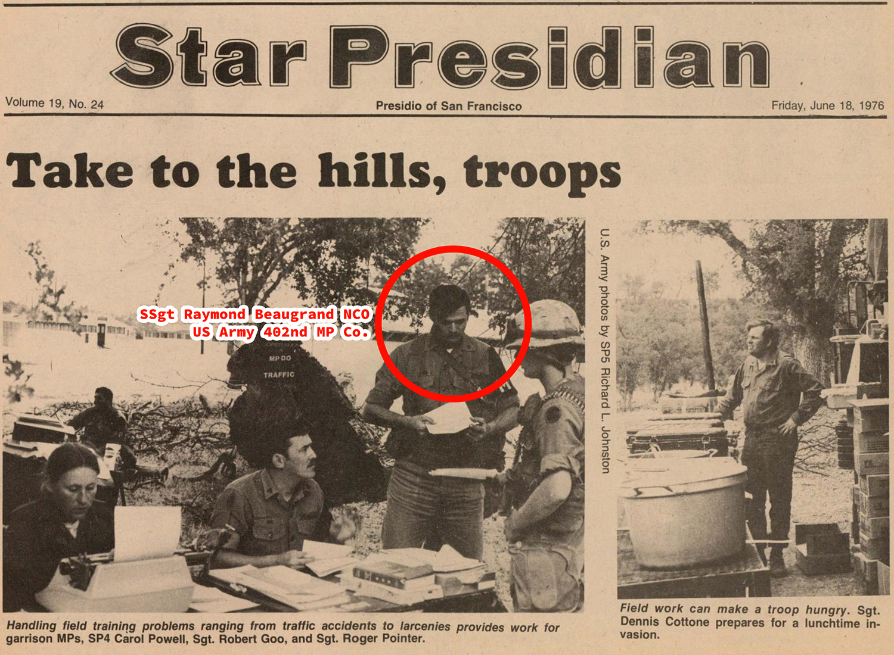
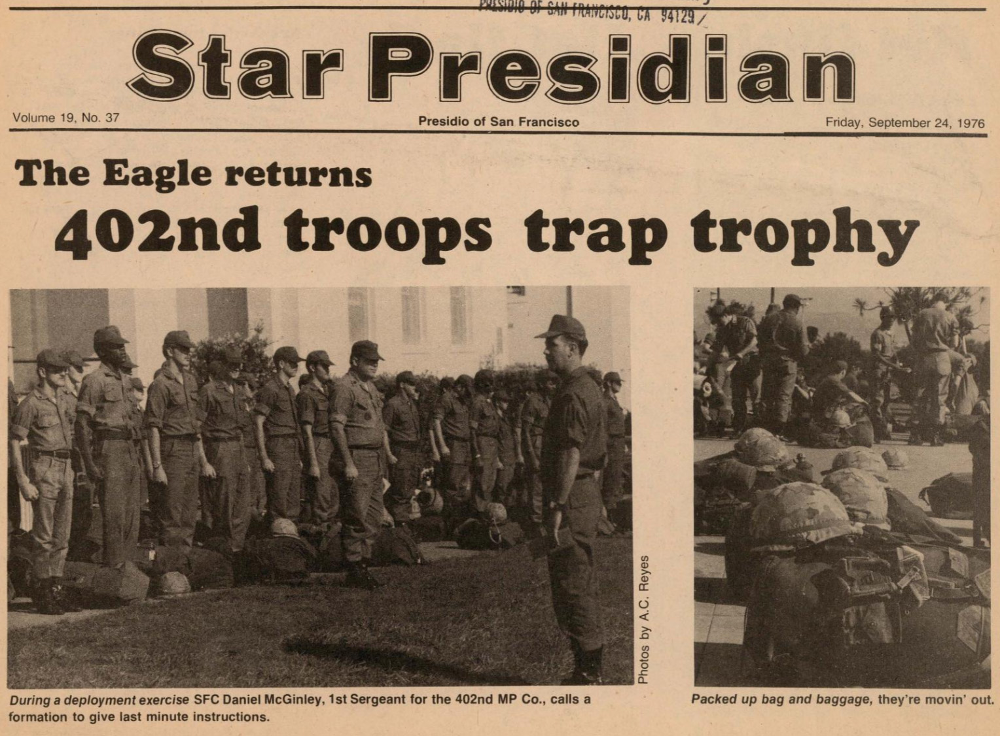
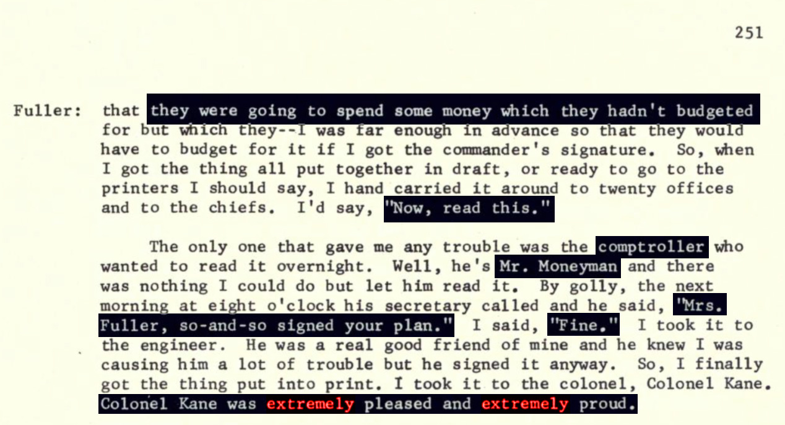
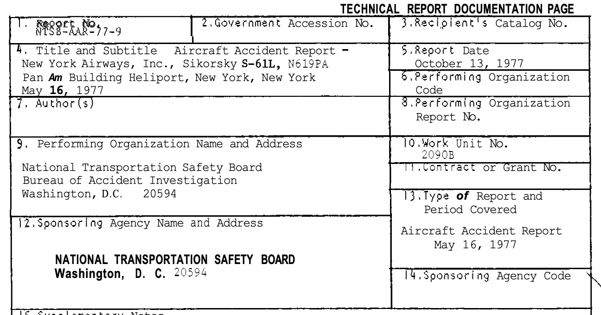
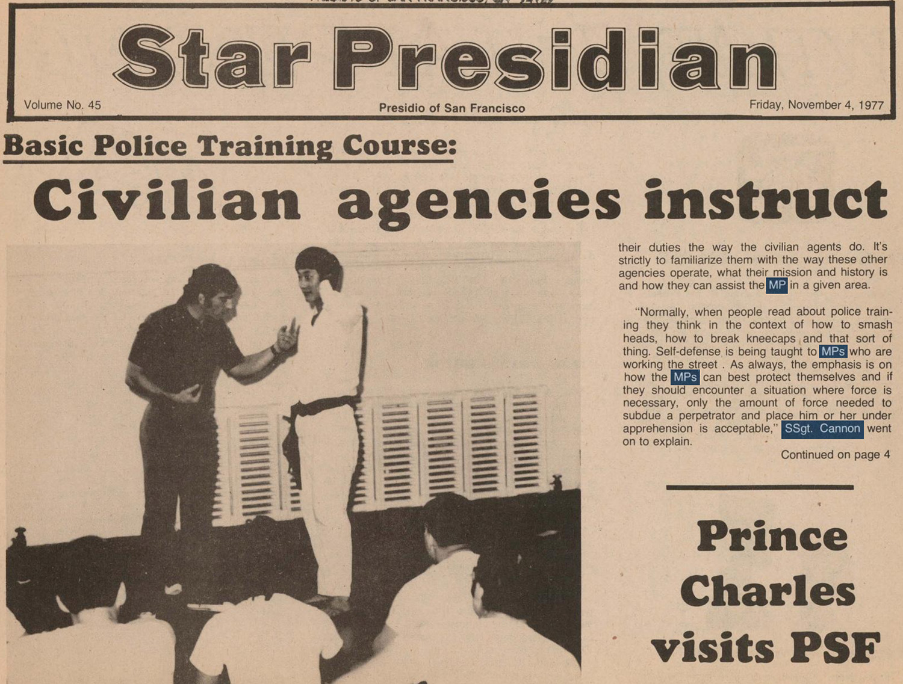
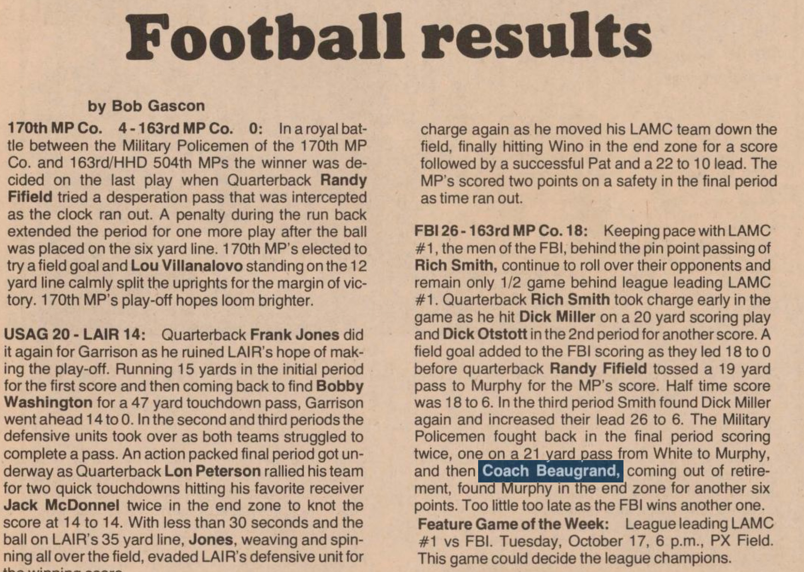
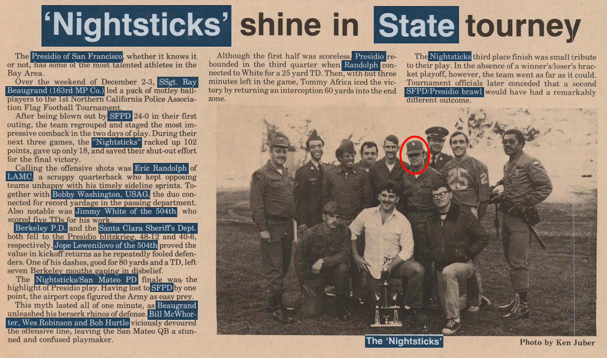
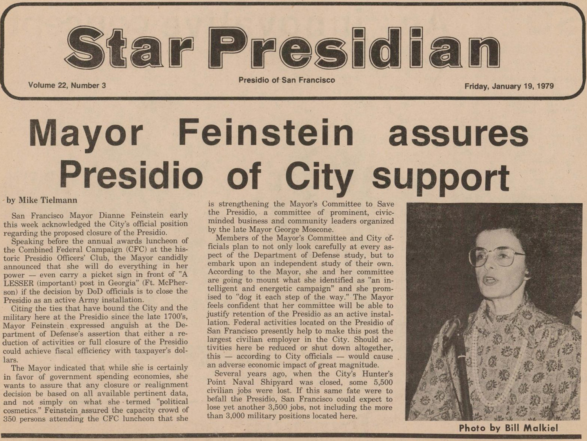
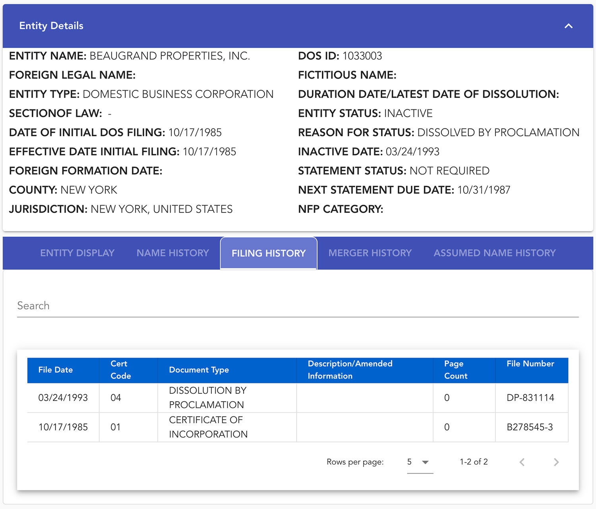
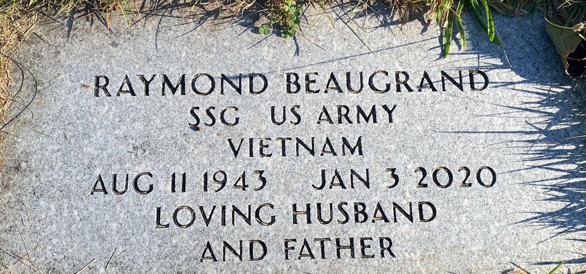

# Ray Beaugrand
ssn: ###-##-0253 
born: August, 11 1943 
enlisted: July, 1 1965 
buried: ARLINGTON CEMETERY, 748 SCHUYLER AVENUE, KEARNY, NJ 07032

## October 2, 1922
Grandfather BEAUGRAND, RAYMOND Sr born 2 October 1922, received Social Security number ###-##-3621 indicating New Jersey)

138143621
**ssn:** ###-##-3621

## August 11, 1943
RAYMOND J BEAUGRAND II,  (Social Security number ###-##-0253) was born 11 August 1943

146340253
**ssn:** ###-##-0253

## July 1, 1965

RAYMOND J BEAUGRAND II entered the United States Army 1 July 1965

## Marriage 1968
VAN DER VLIET, ELISABETH (the bride) and RAYMOND BEAUGRAND were issued marriage license number 2876 in 1968 in New York County (Manhattan), New York, U.S.A.
https://sortedbyname.com/letter_v/vandervliet/index_1.html

**year:** 1968  
**location:** Manhattan, NY
**license:** 2876

## Oct 4, 1970
**name:** Raymond J Beaugrand III  
**birth:** unknown  
**death:** October 4, 1970
**plot:** Sylvan Lawn, 2018, Grave 10
**burial:** Arlington Memorial Park
**location:** Kearny, Hudson County, New Jersey, USA
**memorial:** 281401658  

## June 18, 1976

[Archive Star Presidian 1978](https://archive.org/details/StarPresidianVolume19/page/n99/mode/2up)

### Photo Left Side
caption: Handling field training problems ranging from traffic accidents to larcenies provides work for garrison MPs, SP4 Carol Powell, Sgt. Robert Goo, and Sgt. Roger Pointer.

1. SP4 Carol Powell 402nd MP Co. (sitting)
2. Sgt. Robert Goo 402nd MP Co. (sitting)
3. SSgt. Ray Beaugrand NCO 402nd MP Co. (standing center)
4. Sgt Roger Pointer 402nd MP Co. (standing right)
5. MP DO TRAFFIC standing background faced away.
6. Unnamed 402nd MP sitting in background.

### Photo Right Side
caption: Field work can make a troop hungry. Sgt. Dennis Cottone prepares for a lunchtime in¬ vasion.

1. Sgt Dennis Cottone 402nd MP Co. Cook

### Article
Leaving the Presidio on the 6th, the 402nd MP Battalion motored to Ft. Ord to begin their week of field training.

The MPs had to qualify with the M-16 in day and night fire. The M-60 was also fired for familiarization.

After the rifle qualification, the troops motor marched from Ft. Ord to Hunter Liggett, where they set up a defense position to conduct the Army Training Evaluation Program (ATEP).

The ATEP consists of a number of exercises which include: circulation control, prisoner of war operations, MP station operations, convoy es¬ corts, both day and night, physical security, traffic reconnaissance, control of civil disturbance, patrol of area operations, performance of organizational support activities, rear area protection operation and operating in electronic warfare environments.

“We feel the company training was outstanding and beneficial. Right now, we’re looking forward to the ATEP field problem from the 8th of July through the 15th, at Camp Roberts,” stated Staff Sergeant Ray Beaugrand, NCO of the company.

Special thanks to Fort Ord’s Capt. Krump for help with Hunter Liggett photos.

----

## July 6 1976 Fort Ord
July 6, 1976 - Leaving the Presidio on the 6th, the 402nd MP Battalion motored to Ft. Ord to begin their week of field training. The MPs had to qualify with the M-16 in day and night fire. The M-60 was also fired for familiarization.
const: #FortOrd = Fort Ord is a former United States Army post on Monterey Bay on the Pacific Ocean coast in California, which closed in 1994 due to Base Realignment and Closure (BRAC) action.

## July 8 1976 Hunter Liggett
July 8, 1976 - Troops motor marched from Ft. Ord to Hunter Liggett
task: Set up a defense position to conduct the Army Training Evaluation Program (ATEP).
const: #ATEP = The ATEP consists of a number of exercises which include Circulation Control, Prisoner of War Operations, MP Station Operations, Convoy Escorts, Both Day and Night, Physical Security, Traffic Reconnaissance, Control of Civil Disturbance, Patrol of Area Operations, Performance of Organizational Support Activities, Rear Area Protection Operation and Operating in Electronic Warfare Environments.

const: #HunterLigget = Hunter Liggett Army Combat Training Center where the Army 402nd MP setup for the #ATEP on July 8, 1976 to July 15, 1976.

## July 15, 1976 
**Camp Roberts**

const: #ATEP = The ATEP consists of a number of exercises which include Circulation Control, Prisoner of War Operations, MP Station Operations, Convoy Escorts, Both Day and Night, Physical Security, Traffic Reconnaissance, Control of Civil Disturbance, Patrol of Area Operations, Performance of Organizational Support Activities, Rear Area Protection Operation and Operating in Electronic Warfare Environments.

## September 24, 1976
**The Eagle returns**  
**402nd troops trap trophy**

**left:** During a deployment exercise SFC Daniel McGinley, 1st Sergeant for the 402nd MP Co., calls a formation to give last minute instructions.  
**right:** Packed up bag and baggage, they're movin' out.

by Ron Renouf

As the members of the U.S. Army Military Police Corps celebrate their anniversary today, the men and women of the 402nd Military Police Company at the Presidio have something special to celebrate.

The Eagle Trophy comes home today.

Presented to the U.S. Army Forces Command military police unit that is judged to most epitomize the spirit of combat readiness, the presentation of the award this morning at Forces Command Headquarters, Fort McPherson, Georgia marks the second time in the three year history of the award that a Presidio based unit and a company of the 504th Military Police Battalion has won it.

When the award was initiated in Fiscal Year 1974, it was the 170th Military Police Company here that claimed the honor of “Top White Hats.” Last year, the 82nd Military Police Company at Fort Bragg, N.C., took it. This year, the 402nd is returning it to the Presidio.

Commanded by 32-year-old Captain Raymond A. Reass, a Philadelphia, Pa., native, the 402nd participated in activities from up and down the west coast, to Fort Chaffee, Ark. as part of their award winning performance during the past year.

In July, 1975, men of the unit underwent Special Weapons and Tactics (SWAT) training at Hamilton Air Force Base in California. Also that month, they were on the range for familiarization firing with the 12-gauge shotgun and qualification firing with the .38 and .45 caliber handguns.

From late July through mid-October, the company saw duty at Fort Chaffee, Ark., providing security at the refugee camp established there in support of those who fled Southeast Asia in the wake of the communist takeover.

Returning to their home at the Presidio, they spent the remainder of the month participating in FBI SWAT training again—this time at Tiburon, Ca.

Training tapered off for the holidays, but February saw a 400-mile plus motor march to Fort Irwin, Ca., where the unit was involved in Exercise Bold Eagle—an exercise that showed their ability to operate in desert terrain.

Upon their completion of the exercise at Fort Irwin, the 402nd conducted their annual Chemical - Biological - Radiological (CBR) Proficiency Test. Following that tearful experience, it was back on the Fort Barry range to qualify again with the .38 and .45 caliber handguns.

In June they took to the road again, this time to the range at Fort Ord, Ca., to fire the M-16 rifle and M-60 machine gun. During the same month, they moved on to Hunter Liggett military reservation, south of Fort Ord, to conduct yet another Field Training Exercise (FTX).

When they returned home, they found a physical training (PT) testing waiting for them.

And yet in spite of their heavy training schedule — or perhaps because of it — they were still able to perform the second of their four major missions to the post — that of performing law enforcement/crime prevention activities within the confines of the Presidio and its sub-posts every other month.

The training itself accomplished the first mission — that of being prepared at any time to deploy anywhere in the world.

The third item in the 402nd mission states that they will participate in military funerals, posthumous award ceremonies, honor guards, color guards, and salute batteries. They normally catch these duties during the second two-week period of their training month — the month they are not providing law enforcement support to the Presidio. .

And finally, the men and women of the 402nd Military Police Company are required to be ready to perform a civil disturbance mission within any area of the Continental United States. This activity requires many more hours of strenuous training to develop and maintain peak proficiency.

During the period of time the 402nd was at Fort Chaffee, they also remembered their responsibilities at home by contributing approximately $14,000 to the Combined Federal Campaign last year.

Personal development through the field of education is high on the list of priorities established by Capt. Reass. Presently, nearly 94 per cent of all personnel assigned to the company have high school diplomas. Eight received theirs during Fiscal Year 76 or are presently enrolled at the Education Center for this purpose.

During presentation ceremonies this morning at U.S. Army Forces Command Headquarters, Fort McPherson, Georgia, Captain Raymond A. Reass, commander of the 402nd Military Police Company received the trophy from Colonel A. A. Ackerman, chief of the provost marshal’s law enforcement divi¬ sion.

## January 21, 1977
**Mr. Moneyman**

**link:** [Jean Wood Fuller Link](https://archive.org/details/orgwomenvolpolgo00fullrich/page/n607/mode/2up)  
**page:** 608  
**name:** Jean Wood Fuller  
**group:** Regents of the University of California  
**library:** The Bancroft Library  
**university:** University of California at Berkeley  
**requests:** Regional Oral History Office  
**project:** Women in Politics Oral History Project  
**women:** Lovilla Lalor, M.F. Small, Isabelle Swartz, Mildred Younger  
**interviewer:** Mariam Feingold Stein  

The only one that gave me any trouble was the comptroller who wanted to read it overnight. Well, he's Mr. Moneyman and there was nothing I could do but let him read it. By golly, the next morning at eight o'clock his secretary called and he said, "Mrs. Fuller, so-and-so signed your plan." I said, "Fine." I took it to the engineer. He was a real good friend of mine and he knew I was causing him a lot of trouble but he signed it anyway. So, I finally got the thing put into print. I took it to the colonel, Colonel Kane. Colonel Kane was extremely pleased and extremely proud.

## February 11, 1977
**Mini, but mighty**

quote: The Blue Royals’ coaches, John Martin and Ray Beaugrand, say it will be the three 13-year-olds’ defensive action that's going to carry them through the upcoming playoffs. “We have the height in Tim Dillon, Mike Wheeler, and Stacey Spain, and the storm in Reyes, Golden and Payne,” said Beaugrand.
coaches: John Martin and Ray Beaugrand
team: Blue Royals DYA
team: Peter Reyes #25, Mitch Golden #22, and Greg Payne #11, and Tim Dillon #5, Mike Wheeler #93, Stacey Spain #39 all assault, chase, badger, opponents so well they are able to take command of any situation as soon as someone other than their team members have the ball.

## May 16, 1977 
**Accident Pan Am Building**

**report:** NTSB-AAR-77-9
**accident date:** May 16, 1977
**report date:** October 13, 1977
**title:** Aircraft Accident Report - New York Airways, Inc.
**subtitle:** Sikorsky S-61L, N619PA Pan Am Building Heliport
**work unit no:** 2090B

[NTSB-AAR-77-9 Accident Report](https://www.ntsb.gov/investigations/AccidentReports/Reports/AAR7709.pdf)

May 16, 1977 Helicopter Accident in New York

### Abstract 
About 1735 e.d.t., on May 16, 1977, the right landing gear of a New York Airways, Inc., Sikorsky S-61L; N619PA, failed while the aircraft was parked, with rotors turning, on the rooftop heliport of the Pan Am Building in New York, New York The aircraft rolled over on its right side and was substantially damaged. At the time of the accident four passengers had boarded the aircraft and other passengers were in the process of boarding. The passengers and the three crew members onboard received either minor or no injuries. However, four passengers who were still outside the aircraft and were waiting to board were killed and one was seriously injured.

One pedestrian on the corner of Medison Avenue and 43rd Street was killed and another was seriously injured when they were struck by a separated portion of one of the main rotor blades of the aircraft.

## May 20, 1977 
**Star Presidian San Francisco**

- May 20, 1977 SQT - New Army Soldier Manual and Skills Qualification Test Announced in the Star Presidian
- May 20, 1977 Eve S. Dropper says "What a bear of a week this one’s been!!! Somehow or another I’ve gotten my wires crossed with just about everyone this week... can’t seem to get things straight! Some weeks it just doesn’t pay to even get out of bed ..." and ends the article with "And last but never least, my final helpful hint. A brisk ‘rub’ with a mixture of cold water and vinegar will remove coffee stains from a sheep. Keep watching this space for more helpful hints!!! Think you can stand anymore???

## October 29, 1977
**Prince Charles Visits PSF**

caption: ROYAL VISITOR ... H.R.H. Prince Charles, The Prince of Wales, and LTG Edward M. Flanagan, Jr., Commanding General, Sixth US Army, depart Sixth Army Headquarters during Prince Charles’ visit to the Presidio of San Francisco on October 29, 1977.

H.R.H. Prince Charles, The Prince of Wales, vis¬ ited Sixth U.S. Army Headquarters, Presidio of San Francisco, on Saturday, October 29. Lieuten¬ ant General Edward M. Flanagan, Jr., Sixth Army’s Commanding General, presented Prince Charles with an overview of the U.S. Army today and Sixth Army’s role in the Total Army.

Prince Charles’ visit to Sixth Army, requested by the British Consul General, was his only visit to an Army installation during his recent tour of the Un¬ ited States.

Upon leaving Sixth Army Headquarters, Prince Charles stopped to speak with a number of spec¬ tators gathered to greet H.R.H. The Prince and his party then departed the Presidio by helicopter to continue his California visit.

## October 31, 1977
**Basic Police Training Course: Civilian agencies instruct**  
**date:** October 31 to November 11

Members of the 402nd MP Co. are undergoing Basic Police Training from October 31 through November 11. Military police performing their duties on the Presidio maintain a close working relationship with civilian police agencies during their everyday duties.

## November 30, 1977
**Makeup Artists**  
**date:** November 11 - 19, 1977

Make up artists will be demonstrating a major line **Nov. 11 through 19**, showing the new fall look in cosmetics. Come in and participate and, at the same time, **enter your name** for the free drawing. An all expense paid eight-day trip for two to **Paris**, France could be yours. No purchase is required. **Drawing** will be held at **2 p.m. Nov. 30**. All exchange patrons are invited to visit the **Main Store** and enter the drawing for this fabulous prize.

## June 9, 1978 
**TROOP TALK**

**group:** 402nd MP Co 

The 402nd MP Co. continues to stay on top in its softball efforts. The team is unbeaten so far this season. Recently, Sgt. Al Smith led his team to a whopping 13-3 victory over D. Co., 864th Engrs. The team has a 4-0 record. Pvt. Mark Simmons recently graduated from Wheeled Vehicle Mechanics School at Ft. Ord. Sgt. Phillip Scales and SSgt. Raymond Beaugrand both qualified at Leadership Management School, also at Ft. Ord. 

after June 9 1978 - Leadership Management School Ft. Ord

## October 13, 1978 
**Football Results**

**group:** 163rd MP Co  

FBI 26-163rd MP Co. 18: Keeping pace with LAMC #1, the men of the FBI, behind the pin point passing of Rich Smith, continue to roll over their opponents and 
remain only 1/2 game behind league leading LAMC #1. Quarterback Rich Smith took charge early in the game as he hit Dick Miller on a 20 yard scoring play 
and Dick Otstott in the 2nd period for another score. A field goal added to the FBI scoring as they led 18 to 0 before quarterback Randy Fifield tossed a 19 yard pass to Murphy for the MP’s score. Half time score was 18 to 6. In the third period Smith found Dick Miller again and increased their lead 26 to 6. The Military Policemen fought back in the final period scoring twice, one on a 21 yard pass from White to Murphy, and then Coach Beaugrand, coming out of retirement, found Murphy in the end zone for another six points. Too little too late as the FBI wins another one. 
Feature Game of the Week: League leading LAMC #1 vs FBI. Tuesday, October 17, 6 p.m., PX Field. 

This game could decide the league champions.

game: LAMC #1 vs FBI October 17 1978 6pm at PX Field.

## December 3, 1978 
**Nightsticks**

**date:** December 2-3  
**person:** SSgt. Ray Beaugrand (163rd MP Co.)  
**place:** 1st Northern California Police Association Flag Football Tournament.  
**against:** SFPD, FBI San Francisco
**team:** Nightsticks

- **Eric Randolph** of **LAMC**, a scrappy quarterback who kept opposing teams unhappy with his timely sideline sprints. 
- **Bobby Washington**, **USAG**, the duo connected for record yardage in the passing department. 
- **Jimmy White** of the **504th**, who scored five TDs for his work. 
- **Jope Lewenilovo** of the 504th proved the value in kickoff returns as he repeatedly fooled defenders. 
- **Beaugrand** unleashed his Berserk Rhinos of Defense. 
- **Bill McWhorter**, **Wes Robinson** and **Bob Hurtle** viciously devoured the offensive line
- **San Mateo QB** a stunned and confused playmaker on the take. 
- **Tommy Africa** iced the victory. 

## January 19, 1979
**Mayor Feinstein assures Presidio of City support**

San Francisco Mayor Dianne Feinstein early this week acknowledged the City’s official position regarding the proposed closure of the Presidio.

Speaking before the annual awards luncheon of the Combined Federal Campaign (CFC) at the his¬ toric Presidio Officers’ Club, the Mayor candidly announced that she will do everything in her power — even carry a picket sign in front of "A LESSER (important) post in Georgia” (Ft. McPherson) if the decision by DoD officials is to close the Presidio as an active Army installation.

Citing the ties that have bound the City and the military here at the Presidio since the late 1700’s,

Mayor Feinstein expressed anguish at the Department of Defense’s assertion that either a reduction of activities or full closure of the Presidio could achieve fiscal efficiency with taxpayer’s dollars.

The Mayor indicated that while she is certainly in favor of government spending economies, she wants to assure that any closure or realignment decision be based on all available pertinent data, and not simply on what she termed "political cosmetics.” Feinstein assured the capacity crowd of 350 persons attending the CFC luncheon that she is strengthening the Mayor’s Committee to Save the Presidio, a committee of prominent, civicminded business and community leaders organized by the late Mayor George Moscone.

Members of the Mayor’s Committee and City of¬ ficials plan to not only look carefully at every as¬ pect of the Department of Defense study, but to embark upon an independent study of their own. According to the Mayor, she and her committee are going to mount what she identified as "an in¬ telligent and energetic campaign” and she prom¬ ised to "dog it each step of the way.” The Mayor feels confident that her committee will be able to justify retention of the Presidio as an active instal¬ lation. Federal activities located on the Presidio of San Francisco presently help to make this post the largest civilian employer in the City. Should ac¬ tivities here be reduced or shut down altogether, this — according to City officials — would cause an adverse economic impact of great magnitude.

Several years ago, when the City’s Hunter’s Point Naval Shipyard was closed, some 5,500 civilian jobs were lost. If this same fate were to befall the Presidio, San Francisco could expect to lose yet another 3,500 jobs, not including the more than 3,000 military positions located here.

## February 23, 1979 
**Relocated to Germany**

- **SSgt. Raymond Beaugrand** whose new assignment takes him to Germany. 
- **SSgt. Raymond Beaugrand** served as a stringer for the Star Presidian during his tour here. 

The Public Affairs Office send him our thanks for a job well done and our best wishes for a successful tour in **Germany**. 

## October 17, 1985

### Beaugrand Properties, Inc.

10/17/1985 - B278545-3 > CERTIFICATE OF INCORPORATION BEAUGRAND PROPERTIES, INC.  
03/24/1993 - DP-831114 > DISSOLUTION BY PROCLAMATION  
**name:** RAYMOND L. BEAUGRAND  
**address:** 200 PARK AVE, NEW YORK, NY, UNITED STATES, 10166  
**entity:** BEAUGRAND PROPERTIES, INC.  
**type:** DOMESTIC BUSINESS CORPORATION  
**filing:** 10/17/1985  
**county:** NEW YORK  
**jurisdiction:** NEW YORK, UNITED STATES  
**dos_id:** 1033003  
**status:** INACTIVE  
**reason:** DISSOLVED BY PROCLAMATION  
**inactive:** 03/24/1993  

## March 31, 1987
RAYMOND J BEAUGRAND released from Army 31 March 1987

## June 1, 1997
BEAUGRAND, RAYMOND Sr born 2 October 1922 138-14-3621 died 1 June 1997

**birth:** Oct 2, 1922
**death:** Jun 1, 1997
**burial:** Arlington Memorial Park
**location:** Kearny, Hudson County, New Jersey, USA
**plot:** Sylvan Lawn, Plot 2018, Grave 9
**memorial:** 206832651

## June 6, 1998

Domain Information beaugrand.com 

**Name:** BEAUGRAND.COM  
**Registry Domain ID:** 1382957_DOMAIN_COM-VRSN  
**Registered On:** 1998-06-06T04:00:00Z  
**Expires On:** 2026-06-05T04:00:00Z  
**Updated On:** 2025-04-16T14:38:19Z  
**Name Servers:** NS73.WORLDNIC.COM, NS74.WORLDNIC.COM

**Name:** Beaugrand Properties, Inc.  
**Organization:** Beaugrand Properties, Inc.  
**Phone:** (212) 685-5550  
**Fax:** (212) 545-1502  
**Email:** ray@beaugrand.com  
**Mailing Address:** 100 PARK AVE RM 1600, NEW YORK, NY, 10017-5538

## January 3, 2020

[Raymond Beaugrand Gravesite](https://www.findagrave.com/memorial/206832610/raymond-joseph-beaugrand)

**birth:** Aug 11, 1943
**death:** Jan 3, 2020
**burial:** Arlington Memorial Park
**location:** Kearny, Hudson County, New Jersey, USA
**plot:** Sylvan Lawn, 2018, Grave 12  
**memorial:** 206832610

BEAUGRAND, RAYMOND J (Social Security number 146-34-0253) was born 11 August 1943, entered the United States Army 1 July 1965, was released 31 March 1987, and he died 3 January 2020.

Beaugrand, Raymond, who was SSG in the US ARMY during the Viet Nam War, was born 11 August 1943, died 3 January 2020, and was buried in ARLINGTON CEMETERY, 748 SCHUYLER AVENUE, KEARNY, NJ 07032

